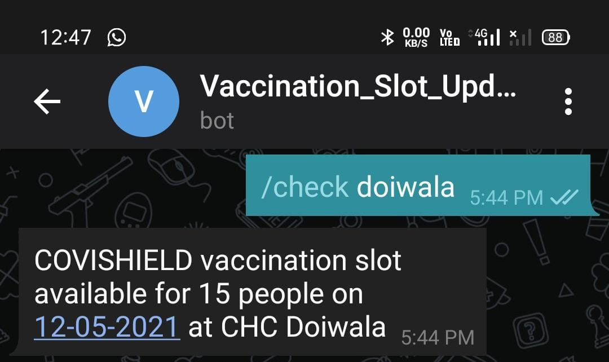

# Asynchronous-Cowin-Telegram-Bot
A telegram bot that searches for vaccination centeres/slots available in the specified pincode for next 5 dates every 5 minutes and filters out the one you want to keep track of based on the keyword specified.

For example, Let's say this is the configuration:
```
PINCODE = 248001
SEARCH_WORD = "ganpati"
```

There are 3 vaccination centers for the Pin 248140:
* CHC Doiwala  
* Ganpati Wedding P.Bhaniyawala  
* Dudhli  

Since the specified keyword "ganpati" matches with the second vaccination center, it will keep track of availability of vaccination slots in that location. And whenever there is any free slot available, it will send a message to the user on telegram.

It also has a functionality when you want to check for slots in other vaccination centers in the same pincode on the go. You can trigger the "check" function and pass it any other keyword that matches with the vaccination slots in the specified pincode.



## How to use
* Create a telegram bot and obtain the access token
* Put that token as the value of variable ```TOKEN```.
* Specify ```SEARCH_WORD```(keyword) and ```PINCODE``` of your preference.
* Deploy and run it in a system which runs for a longer period of time(for example, VPS).
* Once the bot is running, simple type ```/check_slots``` command in your telegram bot message box. The bot will start and will run forever.
* To check slots in other vaccination centers in the same pincode, query the "check" function by typing ```/check <keyword>```.

### Final Words
As there is already a lot of traffic on Cowin's API server, they might put extended restrictions on the number of HTTP requests being generated from a single IP. You might wanna consider slowing it down by changing those values inside the sleep() function.
